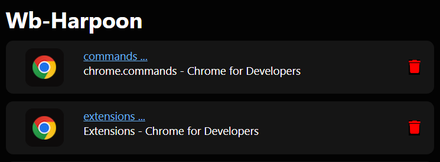

>
> Web Extension inspired by vim extension '[Harpoon](https://github.com/ThePrimeagen/harpoon)'.
>
> Move between marked tabs with Ease.
>

## Usage

+ `Ctrl+m` : Open popup -> lists currently marked tabs
+ `Shift+e,a` : Marks current tab

## Screenshots

